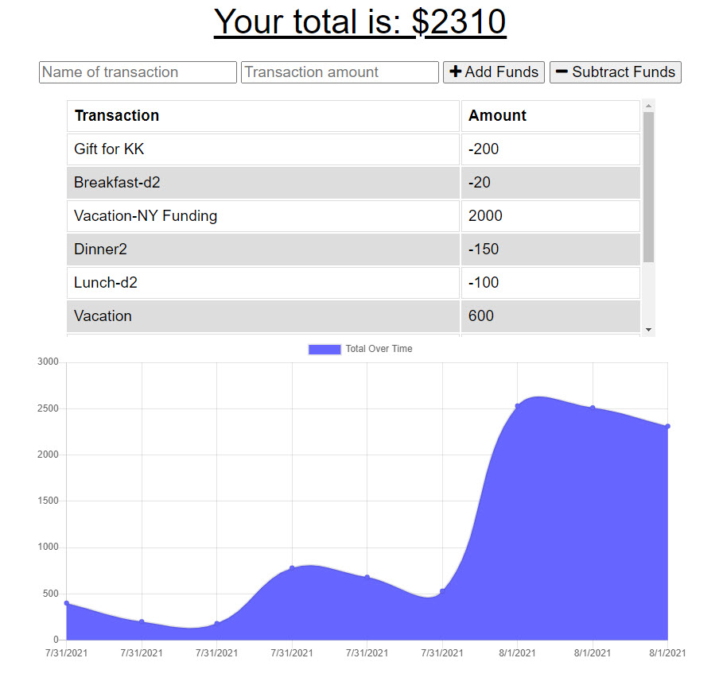

# Mark S. Moore - Week 19 Challenge

## Budget Tracker

### The Challenge was to update a Budget Tracker to allow online and offline functionality

The following files were added to the project to make it functional
* public/js/idb.js
* public/manifest.json
* public/server-worker.js

### User Story

    AS AN avid traveler
    I WANT to be able to track my withdrawals and deposits with or without a data/internet connection
    SO THAT my account balance is accurate when I am traveling

### Acceptance Criteria

    GIVEN a budget tracker without an internet connection
    WHEN the user inputs an expense or deposit
    THEN they will receive a notification that they have added an expense or deposit
    WHEN the user reestablishes an internet connection
    THEN the deposits or expenses added while they were offline are added to their transaction history and their totals are updated

### Code Repository

    <https://github.com/marksmoore/Budget-Tracker>

### Screenshots

### Actual website

<https://fathomless-mountain-90293.herokuapp.com/>
